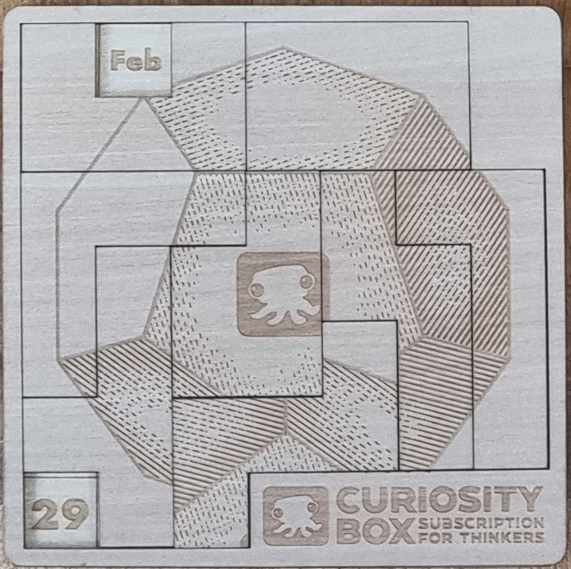

Find all solution for the Calendar puzzle (from [CuriosityBox](https://www.curiositybox.com/collections/puzzles) or [DragonFjord](https://www.dragonfjord.com/product/a-puzzle-a-day/))



# CLI usage

## Print solution

Print the solution for the current day

```sh
$ ./cbox-calendar-puzzle print
```

Print the solution for a specific day

```sh
$ ./cbox-calendar-puzzle print 7 1
```


## Find and save all solutions

Start the solver

```sh
$ ./cbox-calendar-puzzle solve-all
```

# To-do list

* add a REST server
* add range walker function and parallelism
  * add solutions comparison function (s1 < s2)
* fix LoadSolution to set board.Completed correctly
